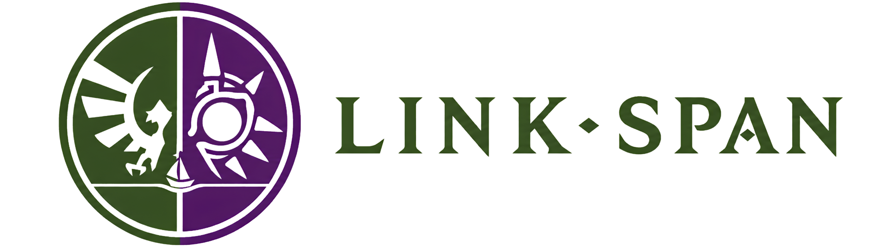

<p align="center">
  
</p>

# Link-Span

**English** · [Português](README.pt-BR.md)

**A shared Lua modloader for [Shipwright](https://github.com/HarbourMasters/Shipwright) (Ocarina of Time) and [2Ship2Harkinian](https://github.com/HarbourMasters/2ship2harkinian) (Majora's Mask).**

Write a Lua mod **once** and run it in both games. Game-exclusive features sit behind capabilities and namespaces (`ship.mm.*`, `ship.oot.*`), so nothing is faked when a feature doesn't exist in the other game.

```lua
local ship = require("ship")

ship.events.on("game.ready", function()
    ship.log.info("Hello from " .. ship.game.id() .. " host=" .. ship.game.host_version())
end)
```

That same file prints `Hello from mm ...` in 2Ship and `Hello from oot ...` in Shipwright.

---

## Status

| Piece | State |
|---|---|
| Isolated, sandboxed Lua 5.4 runtime per mod | ✅ |
| Manifest, discovery, SemVer, dependency graph | ✅ |
| Event dispatcher (observe/filter/transform/consume) + timers | ✅ |
| `ship.*` API + codegen (C++ bindings + LuaDoc) | ✅ |
| Root loader (`.shipmod`, compatibility, dep ordering, failure isolation) | ✅ |
| Green CI on Linux + Windows | ✅ |
| **2Ship (MM)** adapter loading mods in-game | ✅ (`hello-world`, `dog-spawner`) |
| **Shipwright (OoT)** adapter | in progress |

Integration details in [`coordination/INTEGRATION.en.md`](coordination/INTEGRATION.en.md).

---

## Start here

- **Want to write a mod?** → **[Guide: Writing mods](docs/writing-mods.en.md)**
- **Want to add Link-Span to your own game source and build it?** → **[Guide: Host integration](docs/host-integration.en.md)**
- **API reference** (generated from the schemas) → [`generated/docs/api-reference.en.md`](generated/docs/api-reference.en.md)
- **Examples** → [`examples/`](examples/)
  - [`hello-world`](examples/hello-world/) — the minimal mod (logs the host identity).
  - [`dog-spawner`](examples/dog-spawner/) — an **F** hotkey that spawns a dog in MM (uses `ship.mm.*`).

## Quick start (Windows)

If you want to run Link-Span inside the game (not just develop the core), clone one
of the Link-Span-enabled host forks with submodules, then run the bundled build
helper:

```powershell
# 1. Clone a host fork (OoT or MM) with all submodules
git clone --recurse-submodules https://github.com/BaiterYamato/Shipwright-HyliaFoundry.git
#   or: https://github.com/BaiterYamato/2ship2harkinian.git

# 2. From inside the clone, run the one-shot build script
cd Shipwright-HyliaFoundry
.\extern\link-span\build-game.ps1
```

`build-game.ps1` lives in this repo (the `extern/link-span` submodule inside the
host clone). It verifies prerequisites (Git, CMake ≥ 3.26, Python 3, Visual
Studio 2022 with the MSVC v143 toolset), inits submodules, configures CMake,
generates the custom `.o2r` asset pack **without a ROM**, and builds the game
executable. It auto-detects whether the host is OoT or MM.

The first build produces a runnable `.exe`, but the game is **not playable until
you supply a legitimate Zelda ROM** — the no-ROM step only builds the
ship-defined assets. The script prints the exact `ExtractAssets` command to run
next when you have a ROM. See `build-game.ps1 -Help` for all flags (game
selection, config, skipping steps).

## Installing a mod in the game

Mods live in a `mods/` folder next to the game executable. Each mod is either:

- a **folder** with `manifest.toml` + `main.lua` (easiest while developing), or
- a **`.shipmod`** file (a ZIP with the same files).

```text
<game-folder>/
└── mods/
    ├── hello-world.shipmod
    └── my-mod/
        ├── manifest.toml
        └── main.lua
```

Launch the game: mods are discovered, validated (game/version/API), loaded in
dependency order, and the `game.ready` event fires. One mod failing never takes
down the others. Logs go to the console and to the game's log file
(e.g. `logs/2 Ship 2 Harkinian.log`).

## Building the core (development)

Requires CMake ≥ 3.20, Ninja and a C++20 compiler. Lua 5.4, toml++ and miniz are
fetched via FetchContent.

```bash
cmake -S . -B build -G Ninja
cmake --build build
ctest --test-dir build --output-on-failure
```

On Windows with MinGW, make sure the runtime is on `PATH` (otherwise the test
executables hang on a missing-DLL dialog):

```powershell
$env:Path = "C:\ProgramData\mingw64\mingw64\bin;$env:Path"
```

## Architecture (overview)

```text
Lua mod
   ↓
versioned public API (ship.*)     ← generated from schema/*.yml
   ↓
shared runtime + services (this repository)
   ↓
IGameAdapter
   ├── ShipwrightAdapter (OoT)
   └── TwoShipAdapter (MM)   ← loads mods, dispatches events, exposes ship.mm.*
```

The core **never** includes game headers. Each adapter (inside each game's fork)
translates internal structures into snapshots/handles/events and may install
host-specific bindings (`ship.mm.*`, `ship.oot.*`).

## Contributing

Read [`AGENTS.en.md`](AGENTS.en.md) (working contract) and [`PLAN.en.md`](PLAN.en.md) (roadmap).
Changes to the public API require an RFC in [`rfcs/`](rfcs/). Coordination state
lives in [`coordination/`](coordination/).

## License

The Link-Span core is under the repository license. **Never** commit ROMs,
`.z64`/`.n64`/`.o2r` files, or any copyrighted assets.
